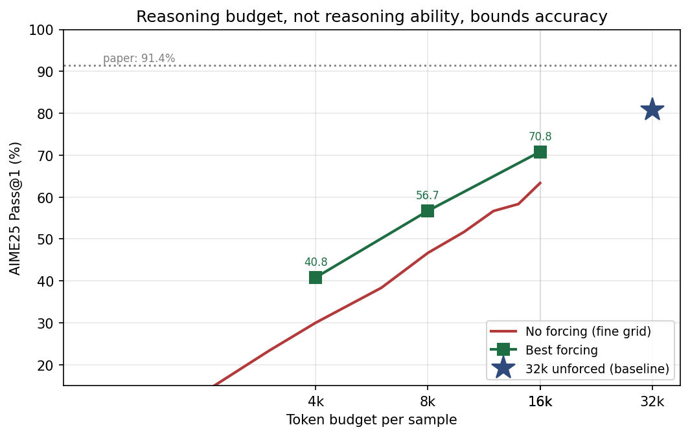
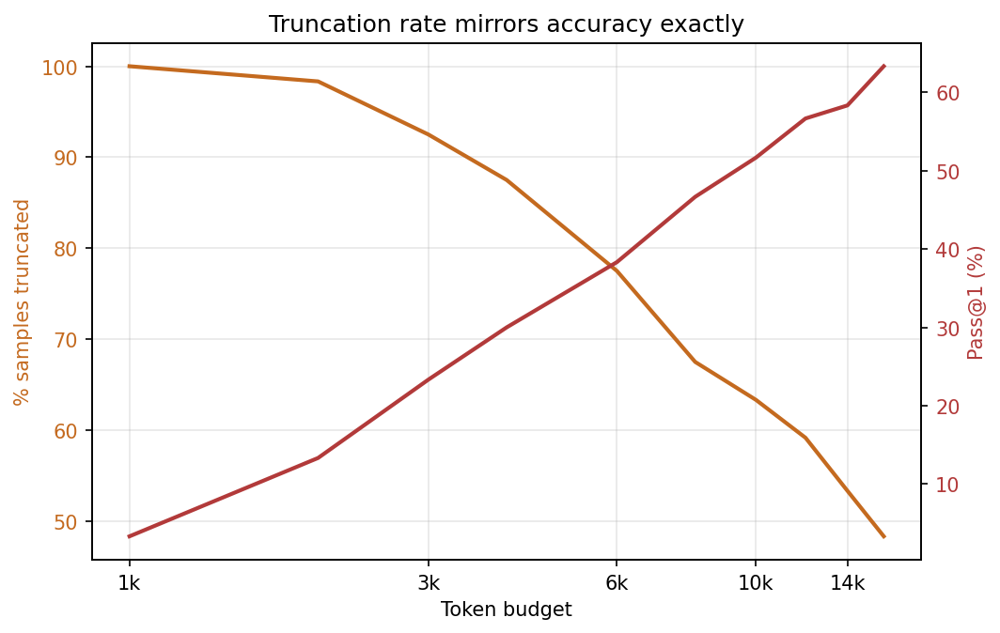
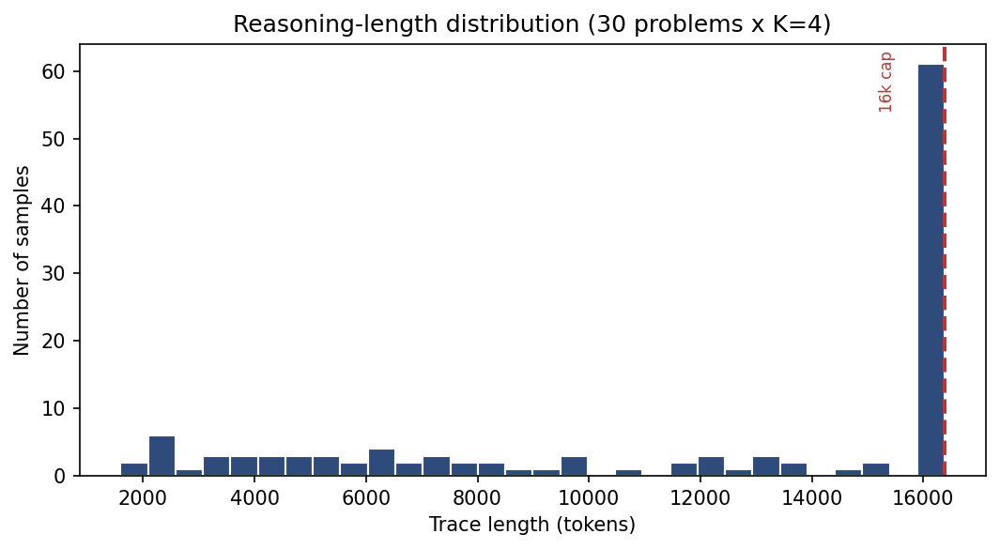

# Reasoning Termination, Not Reasoning Capability

**A budget-forcing study of VibeThinker-3B on AIME 2025.**

CSE465 course project · North South University · Summer 2026

---

## Claim

VibeThinker-3B scores **80.8%** on AIME 2025 in our reproduction, against **91.4%** reported
in its paper. We find the gap is not a reasoning failure — it is a **termination** failure.

Among the 95 of 120 samples that finished generating naturally, essentially all 95 were
correct. Of the 25 that were cut off by the token cap, 23 scored zero — not because the
reasoning was wrong, but because there was no `\boxed{}` answer to grade.

> **The model solves the problem and then fails to stop and say so.**

We test whether **budget forcing** (from [s1: Simple Test-Time Scaling](https://arxiv.org/abs/2501.19393))
recovers this loss. It does, significantly, at every budget — and never at any cost.

No model weights were trained. Everything here is inference-time only, on a single free
Kaggle Tesla T4.

---

## Main result

| Token budget | No forcing | + Budget forcing | Gain | McNemar *p* |
|---|---|---|---|---|
| 4k  | 27.5% / 30.0% | 40.8% | +13.3 | — |
| 8k  | 46.7% | 55.8% | +9.1 | **0.0026** |
| 16k | 63.3% | 70.8% | +7.5 | **0.0077** |
| 32k | 80.8% | not run | — | — |

*4k appears twice because it was measured two independent ways (a genuine 4k run and a
truncation of 16k traces); the 2.5-point difference is 3 samples, within sampling noise.*



Truncation rate and accuracy move inversely across the whole budget range:



Reasoning lengths are strongly bimodal — note this histogram is **right-censored at 16,384
tokens**; the spike at the cap is our limit, not the model's natural stopping point:



---

## Findings

1. **Truncation, not reasoning, is the bottleneck.** `correct` equals `finished` in nearly
   every problem. The entire 91.4 → 80.8 gap is a truncation artifact.

2. **Budget forcing works and is significant at every budget.** +13.3 / +9.1 / +7.5, all
   *p* < 0.01 by McNemar's test.

3. **Budget forcing is strictly non-destructive.** Across **139 forced samples, 0 were
   damaged.** 31 truncated traces already held a correct `\boxed{}`; forcing overwrote every
   one of them and re-derived the *same correct answer*. A "keep the existing answer" hybrid
   scores identically, so it is unnecessary.

4. **The forcing prompt does not matter.** A bare demand, a soft deadline, and a
   summarize-then-answer variant are statistically indistinguishable (identical at 16k).
   The summarize variant costs **2.1× more compute for no gain**.

5. **Recovery rate, conditioned on rescuable samples:** ~1 in 5.

   | Budget | Truncated | Already correct | Rescuable | Rescued | Rate |
   |---|---|---|---|---|---|
   | 8k  | 81 | 17 | 64 | 11 | 17.2% |
   | 16k | 58 | 14 | 44 |  9 | 20.5% |

6. **Forcing beats the selection oracle at small budgets.** `pass@4` bounds any method
   that *selects* among existing samples — CLR, majority voting, self-consistency.

   | Budget | Unforced pass@4 (oracle) | Forced pass@1 |
   |---|---|---|
   | 4k  | 40.0% | **40.8%** |
   | 8k  | 53.3% | **55.8%** |
   | 16k | **73.3%** | 70.8% |

   One forced sample beats the best of four unforced samples at 4k and 8k. Forcing
   generates a new answer rather than choosing among existing ones, so it is not
   bounded by pass@4.

7. **Forcing captures ~80% of the recoverable signal**, so little headroom remains for
   better extraction.

   | Budget | Rescuable | Net ceiling | Rescued | Captured | 95% CI |
   |---|---|---|---|---|---|
   | 8k  | 64 | 14 | 11 | 78.6% | [52%, 92%] |
   | 16k | 44 | 11 |  9 | 81.8% | [52%, 95%] |

   Only ~25% of rescuable traces mention the correct answer anywhere in their final
   20% — the other **75% never derived it**, and no extraction method could recover
   those. **The bottleneck is generating the reasoning, not reading it out.**

### Mechanism

Forcing recovers answers **already latent** in the trace. It cannot manufacture reasoning
that has not happened.

- *Problem 1 (truth 588)* — the summary contains real derived work (`AB=28`, `AC=91`,
  coordinates for `F`). Forcing yields **588**. ✅
- *Problem 13 (truth 60)* — the summary is still setting up (*"the geometric median is the
  unique point where the sum…"*). Forcing yields a confident **124**. ❌

---

## Repository layout

```
src/          standalone scripts for each experimental phase
results/      raw JSON/CSV outputs
figures/      rendered figures
notebooks/    original Kaggle notebooks
archive/      superseded work from an abandoned earlier direction (see below)
PROGRESS.md   full lab notebook: every decision, measurement, and known bug
```

### Reproducing

Each script in `src/` is standalone and expects a GPU with vLLM installed.

```bash
pip install vllm
python src/phase5_baseline.py          # ~8.9 GPU-hours on a T4
python src/phase6_budget_forcing.py    # ~2.1 GPU-hours
python src/phase7_forcing_variants.py  # ~8.9 GPU-hours
python src/phase8_analysis.py          # CPU only, ~1 min
python src/phase9_paired.py            # ~1.3 GPU-hours
python src/phase11_upper_bounds.py     # CPU only, ~2 min
```

`phase7_traces.json` (11 MB, in `results/`) contains all 120 reasoning traces at 16k. Because
generation is autoregressive, **any budget ≤ 16k can be scored from it for free** by
truncating — no GPU required. This was validated: an 8k condition derived this way reproduced
a genuine 8k run (55.8% vs 54.2%, within noise).

---

## Setup

| | |
|---|---|
| Model | `WeiboAI/VibeThinker-3B` — frozen, never trained |
| Benchmark | `math-ai/aime25` — 30 problems |
| Engine | vLLM 0.26.0, `dtype=float16` |
| Hardware | Kaggle free tier, Tesla T4 (16 GB, compute capability 7.5) |
| Sampling | temperature 1.0, top_p 0.95, seed 0, K=4 |
| Total compute | ~22.6 GPU-hours |

The T4 is a Turing card, so FlashAttention-2 is unavailable; vLLM falls back to Triton
attention automatically. bfloat16 is unsupported — float16 is mandatory.

---

## Limitations

Stated plainly, because they bound what these numbers mean.

- **One model, one benchmark, one seed.** Confidence intervals are binomial over 120 samples.
  There is no run-to-run variance estimate, so the honest phrasing is *"the effect exceeds
  plausible sampling noise"* — not *"replicated."*
- **K=4.** Small. Fine for pass@1 but limits per-problem resolution.
- **AIME 2026 was unavailable** as a public dataset, so we used AIME 2025 instead. This is
  arguably better: the VibeThinker paper reports 91.4 for AIME25, giving us a published
  number to validate our harness against.
- **Contamination.** AIME 2025 was released February 2025; the VibeThinker paper is dated
  June 2026 and reports an AIME25 score, so the benchmark was within its evaluation scope.
  Our 80.8% falls *below* their reported 91.4%, which argues against inflation — but we did
  not run an independent decontamination check.
- **`max_model_len` differed across arms** (10240 / 18432 / 32768) for memory reasons. It
  does not affect sampling logits, and the 8k condition measured under two different values
  agreed within noise — but it was not held constant, and we do not claim it was.
- **Forcing's wall-clock cost is prefill**, an artifact of our implementation re-reading each
  trace from scratch. A system reusing the KV cache would make forcing nearly free. Do not
  read our timings as a fundamental cost of the method.
- **32k + forcing was not measured.** The trend (+13.3 → +9.1 → +7.5) suggests roughly +5,
  but this is an extrapolation, not a measurement.
- **The extraction-ceiling population is small** (n=11–14), so the ~80% capture rate has a
  wide interval, roughly [52%, 95%]. The direction is safe; the point estimate is not precise.
- **Forced pass@4 was not computed**, so the oracle comparison in finding 6 is forced
  pass@1 against unforced pass@4, not like-for-like.

---

## `archive/`

Contains a report and viva document from an **abandoned earlier direction** (adding
tool-calling and agentic loops to VibeThinker-3B). That plan was dropped after measurement
showed it was infeasible on free-tier compute: it required ~71 GPU-hours, and a baseline
survey found samples disagreed on only **1 of 30 problems**, leaving no headroom for the
selection-based methods it depended on.

**These documents do not describe the work in this repository.** They are kept because
recording why a direction was abandoned is part of the record.

---

## References

| Paper | Role |
|---|---|
| [VibeThinker-3B](https://arxiv.org/abs/2606.16140) | base model; reports AIME25 = 91.4 |
| [s1: Simple Test-Time Scaling](https://arxiv.org/abs/2501.19393) | budget forcing |
| [DeepSeek-R1](https://arxiv.org/abs/2501.12948) | rule-based RL reasoning |
| [Self-Consistency](https://arxiv.org/abs/2203.11171) | ensembling (ruled out by our data) |
| [Self-Refine](https://arxiv.org/abs/2303.17651) | refinement (ruled out) |
